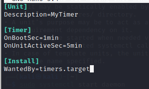

1. Назовите основные отличия и преимущества systemd от sysvinit, опишите подходы.
	- systemd: 
		- создаёт сокеты отдельно от запуска демонов, что позволяет начать работу намного раньше. Также systemd поддерживает множество технологий, которые не поддерживает sysvinit. в Systemd нет runlevel, вместо этого есть targets, определяющие зависимости одних юнитов от других.
		- поддерживает множество технологий, которые не поддерживает sysvinit.
		- в Systemd нет runlevel, вместо этого есть targets, определяющие зависимости одних юнитов от других.
		- Запуск без использования bash/shell скриптов
		- Включены сервисы ранней стадии загрузки, написанные на языке C
2. Каким образом происходит параллельный запуск всех процессов но в то же время сервисы стартуют с нужными зависимостями друг относительно друга.
	- Systemd знает необходимые зависимости для каждого сервиса и может запускать сервисы без зависимостей параллельно.
	- Может заранее создать сокет для сервиса, что позволит начать работу всей системы раньше.
3. Каким образом проверить работает процесс в sysvinit и в systemd?
	- Systemd: 
	
	```bash
	systemctl status <unit>
	```
	- Sysvinit:
	```bash
	chkconfig service_name или service --status-all
	```
4. Как добавить в автозагрузку init скрипт в sysvinit и в systemd?
	- Sysvinit:
		- Добавить скрипт в директорию /etc/init.d
		```bash
		chkconfig srvice_name on)
		```
	- Systemd:
		- Добавить файл с описанием модуля в /etc/systemd/system/
		```bash
		sysctemctl enable service)	
		```
5. Как посмотреть логи в системе systemd по нужному нам процесс
	```bash
	journalctl -u <юнит>
	```	
---

Практика

---
	
1. Скрипт [clean](clean.py) очищает директорию /tmp
2. [daemon](script.sh)
	```bash
	update-rc.d daemon.sh start
	```
	```bash
	service daemon status
	```
	
	```bash
	service daemon start
	```
	
3. Создаем файл описания модуля /etc/systemd/system/daemon.service и запускаем
	
	
4. Создаем файл /etc/systemd/system/mytimer.timer
	
	Создаем файл /etc/systemd/system/mytimer.service:
	
	
